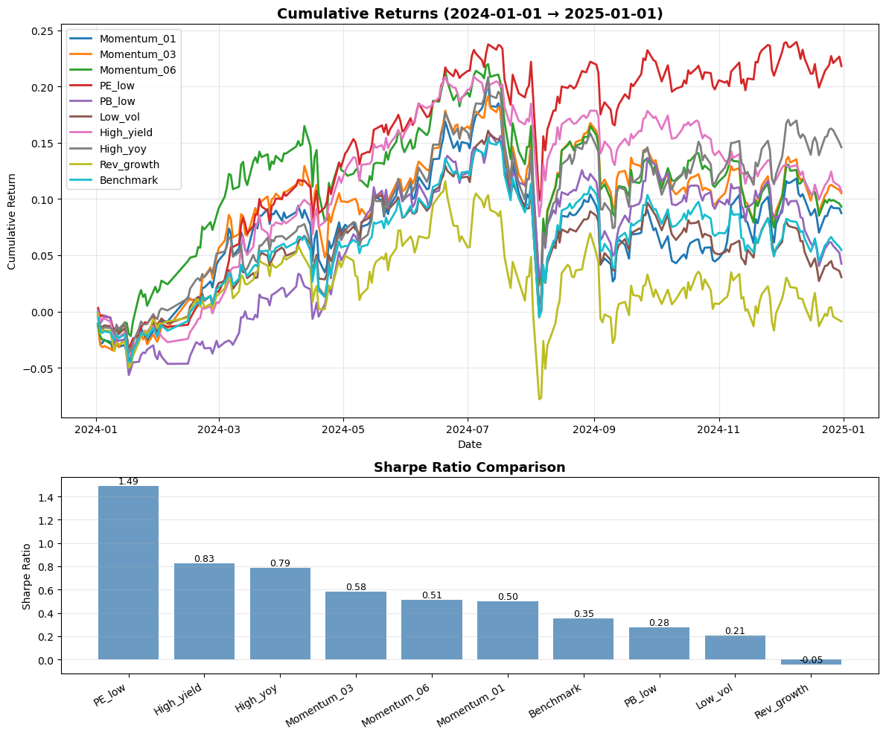
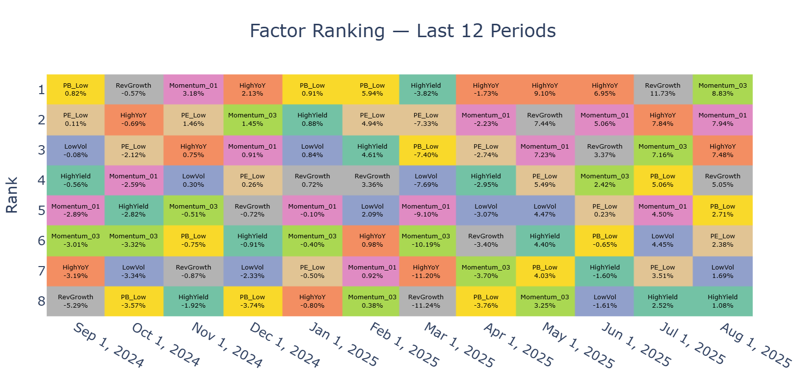

# 因子輪動系統 (Factor Rotation System)

> 一個模組化、可擴充、可視覺化的台股因子輪動回測與報表系統。`dev.ipynb` 扮演 **main** 的角色，其他 `.py` 檔案各自負責資料清洗、因子選股、訊號產生與績效可視覺化。

---

## 🌟 核心特色

- **模組化因子介面**：每個因子模組輸入標準化的日報酬與月度指標，輸出一致的 **0/1 訊號矩陣**，方便並行測試與組合。
- **前視偏誤防護**：以「當月市值 → 下月投資池」與「上月/上季資料決策 → 本月持有」的時間對齊規則，避免不當使用未來資訊。
- **多維度視覺化**：提供累積報酬、Sharpe、月度熱力圖、排名方格圖等報表，快速看見因子相對表現。
- **易於擴充**：新增一個因子，只需在新檔案中實作訊號函式，並於 `dev.ipynb` 串接即可。

---

## 🗂️ 專案結構

```
因子輪動系統/
├─ alpha.py                # 動能因子、樣本池工具
├─ clean_data.py           # 資料清洗
├─ dev.ipynb               # 主流程 (main)
├─ interval_report.py      # 視覺化與績效報表
├─ pe.py                   # 低本益比 (PE Low) 因子
├─ revenue_growth.py       # 利潤率連兩季成長因子
├─ yeild.py                # 高殖利率、營收 YoY 成長因子
└─ 因子資料全.xlsx          # 你原始的因子數據檔 (Excel)

```

> 檔名 `yeild.py` 是歷史拼寫，可視情況改為 `yield_factor.py`（功能不受影響）。

---

## 🔧 安裝與環境

1. 安裝 Python 3.10+
2. 安裝套件：
   ```bash
   pip install pandas numpy matplotlib plotly
   ```
3.（可選）VS Code 推薦外掛：Python、Jupyter、Pylance。

---

## 📦 資料需求（最小可行）

- **日頻報酬/價格**：`pd.DataFrame`，index=`DatetimeIndex`（交易日），columns=`股票代碼`
- **月頻市值**：`pd.DataFrame`，index=月份（`PeriodIndex` 或 `Timestamp`），columns=`股票代碼`
- **其他月頻或季頻基本面**：如 PE、殖利率、營收 YoY、毛利/營益率等（index 允許為日期或 `PeriodIndex`，程式會轉為月份/季別並對齊）

> 系統會把欄位名稱標準化為字串、去空白，並自動處理月/季度對齊、前視偏誤的時間位移。

## 📊 已實作因子與邏輯  

## 📊 因子清單 (Factors Overview)

| 因子名稱 | 檔案 | 類型 | 邏輯 | 特性 |
|----------|------|------|------|------|
| 低本益比 (PE Low) | `pe.py` | Value | 以上月 P/E Ratio 排序，挑出市值 Top-N 宇宙中最低 30% 股票，本月整月持有 | 防禦型，景氣高點後表現穩健 |
| 低股價淨值比 (PB Low) | `pe.py` | Value | 以上月 P/B Ratio 排序，挑出市值 Top-N 宇宙中最低 30% 股票，本月整月持有 | 與 PE Low 類似，具防禦性 |
| 低波動 (Low Volatility) | `pe.py` | Risk (Low Vol) | 計算 21 日 Beta，挑選 Beta > 0 且最低 30% 股票，本月整月持有 | 防守型，波動率最低，年化報酬穩健 |
| 高殖利率 (Dividend Yield High) | `yeild.py` | Dividend | 以上月殖利率排序，挑出市值 Top-N 宇宙中最高 30% 股票，本月整月持有 | 防禦型，提供穩定現金流 |
| 營收 YoY 成長 (Revenue YoY Growth) | `yeild.py` | Growth | 以前兩個月營收年增率排序，排除極端值，選出 Top 30% 股票，本月整月持有 | 反映短期營收動能，景氣谷底領漲 |
| 動能 1M (Momentum 1M) | `alpha.py` | Momentum | 計算過去 1 個月累積報酬，挑出市值 Top-N 宇宙報酬前 30% 且 > 0 股票，下月持有 | 景氣谷底後表現最強，具領漲效果 |
| 動能 3M (Momentum 3M) | `alpha.py` | Momentum | 計算過去 3 個月累積報酬，挑出市值 Top-N 宇宙報酬前 30% 且 > 0 股票，下月持有 | 平滑中期趨勢，減少短期雜訊 |
| 利潤率連兩季成長 (Margin Growth) | `revenue_growth.py` | Quality | 毛利率與營益率需連續兩季成長，依台股財報公告時點對齊 | 反映企業體質改善，適合中長期 |


---

## 🚀 快速開始（以 `dev.ipynb` 為主流程）

1. 讀取資料（價格、報酬、市值、各項基本面）。
2. 用市值建立「**下月可投資池**」（Top-N）。
3. 對每個因子模組：輸入資料 → 產生 **0/1 日頻訊號**（本月持有標 1）。
4. 以訊號與日報酬相乘得到因子收益序列，計算績效。
5. 產出 **累積報酬、Sharpe 長條、月度熱力圖、因子排名方格圖**。

在 `dev.ipynb` 中你可照下面範例串接：

```python
import pandas as pd
from clean_data import clean_mktcap, clean_price
from alpha import build_sample_pool, momentum_signal, pool_to_alpha
from pe import pe_low_signal
from revenue_growth import margin_growth_signal
from yeild import dy_high_signal, yoy_high_signal
from interval_report import perf_report, factor_monthly_heatmap_plotly, factor_rank_tile_full

# 1) 載入並清洗資料
mktcap = clean_mktcap(raw_mktcap_df)         # 月頻市值
price  = clean_price(raw_price_df)           # 日價 → 日報酬
ret    = price.pct_change().fillna(0)

# 2) Top-N 宇宙（當月→下月）
pool   = build_sample_pool(mktcap, top_n=200)

# 3) 產生各因子訊號（本月整月持有）
sig_pe   = pe_low_signal(ret, pe_ratio, pool, bottom_frac=0.3)
sig_dy   = dy_high_signal(ret, dy_ratio, pool, top_frac=0.3)
sig_yoy  = yoy_high_signal(ret, yoy_ratio, pool, top_frac=0.3)
sig_mom  = momentum_signal(ret, pool, top_frac=0.3, lookback_months=1)
sig_mg   = margin_growth_signal(ret, gross_margin, operating_margin, pool)

# 4) 計算各因子日報酬
r_pe  = (ret * sig_pe).mean(axis=1)
r_dy  = (ret * sig_dy).mean(axis=1)
r_yoy = (ret * sig_yoy).mean(axis=1)
r_mom = (ret * sig_mom).mean(axis=1)
r_mg  = (ret * sig_mg).mean(axis=1)

# 5) 績效視覺化與表格
returns_dict = {
    "PE Low": r_pe, "DY High": r_dy, "Rev YoY High": r_yoy,
    "Momentum": r_mom, "Margin Growth": r_mg
}

perf_table = perf_report(returns_dict, start_date="2019-01-01", end_date="2024-12-31")
heatmap_df = factor_monthly_heatmap_plotly(returns_dict, months=12)
tile_df    = factor_rank_tile_full(returns_dict, periods=12, freq="M")
```

---

## 🧠 因子模組與工具（摘要）

- **資料清洗 — `clean_data.py`**
  - `clean_mktcap(raw)`: 將原始（含中文字標題）市值表轉為 `PeriodIndex` 月頻，欄位只保留股票代碼，數值轉 `float`。
  - `clean_price(df)`: 清洗日價資料為 `DatetimeIndex`，欄位固定為股票代碼，刪除空欄與非數字後回傳價格表。

- **樣本池與動能 — `alpha.py`**
  - `build_sample_pool(mktcap, top_n)`: 以「當月市值」挑出 Top-N，**配置到下一個月**的投資池。
  - `momentum_signal(returns, mktcap_pool, top_frac, lookback_months)`: 在每月 Top-N 宇宙內，回看 `L` 個月進行幾何累積報酬，取前 `top_frac` 且 `>0`，於 **下月**持有。
  - `pool_to_alpha(returns, pool)`: 將月度 `pool` 轉為與 `returns` 尺寸相同的日頻 0/1 訊號。

- **估值、風險與基本面因子**  
  - **`pe.py`（共用同一套排序/選股骨架）**：
    - `pe_low_signal(returns, pe_ratio, mktcap_pool, bottom_frac)`: **上月 PE**，Top-N 內取 **最低 bottom_frac**，於 **本月**整月持有。
    - `pb_low_signal(returns, pb_ratio, mktcap_pool, bottom_frac)`: **上月 PB**，Top-N 內取 **最低 bottom_frac**，於 **本月**整月持有。
    - `low_vol_signal(returns, beta_21d, mktcap_pool, bottom_frac)`: **21 日 Beta**，篩 **Beta>0** 並取 **最低 bottom_frac**，於 **本月**整月持有。
  - **`yeild.py`**：
    - `dy_high_signal(returns, dy_ratio, mktcap_pool, top_frac)`: **上月 DY** 在 Top-N 內取 **最高 top_frac**，本月持有。
    - `yoy_high_signal(returns, yoy_ratio, mktcap_pool, top_frac, ...)`: 以 **(m-2) 月**營收 YoY 排序，持有 **本月 m**；可設定極端值上限（如 200%）。
  - **`revenue_growth.py`**：`margin_growth_signal(returns, gross, operating, mktcap_pool)`：
    - 將公告月份對齊到 **Q-DEC 季頻**、判斷 **連兩季成長**（毛利與營益皆成立），並 **shift(1)** 避免前視。
    - 依台股公告時點：Q1→6月、Q2→9月、Q3→12月、Q4→次年4月進場，並每月限制於當月的 Top-N 宇宙。

> 各模組均以「欄位為股票代碼、索引為日/月/季」約定進行時間對齊與型別標準化，訊號輸出為 `int8` 以節省記憶體。

## 📊 報表與視覺化 — `interval_report.py`

- `perf_report(...)`：輸出 **累積報酬曲線 + Sharpe 長條圖** 與 **績效總表**。  
  <!-- 圖片插入位：累積報酬 & Sharpe 圖（你之後把檔案路徑換掉即可） -->
  

- `factor_rank_tile_full(...)`：各期（如月）對因子 **依單期報酬排序** 的「滿版方格圖」。  
  <!-- 圖片插入位：因子排名滿版方格圖 -->
  

  


---

## 📈 研究流程建議

1. 以 `clean_data.py` 清洗原始價量與基本面資料，建立 **`prices`**、**`returns`**、**`mktcap`**、**各種月/季頻指標**。
2. 以 `build_sample_pool(mktcap, top_n=200)` 產生 **下月宇宙**。
3. 按需組合因子：估值（PE）、品質（利潤率成長）、股利（DY）、動能（Momentum）、成長（YoY）等。
4. 將各因子訊號與 `returns` 相乘，得到因子收益序列；可用等權或市值權重聚合。
5. 用 `interval_report.py` 生成 **表格與互動圖**，並以 **月份熱力圖** 與 **方格排名** 觀察一致性與穩健性。
6. 針對前視偏誤、漏斗（樣本池）、極端值截尾、再平衡頻率等議題進行敏感度測試。

---

## 🧪 單元測試與擴充

- 新增因子建議模板：
  1. 接受 `returns`, `some_ratio`, `mktcap_pool`, 以及超參數（如 `top_frac`）。
  2. `index` 與 `columns` 先標準化（字串欄名、`DatetimeIndex`）。
  3. 「上月/上季」做橫切面排序 → **本月**（或規則指定的期間）標 `1`。
  4. 回傳與 `returns` 同尺寸的 `int8` DataFrame（0/1）。
- 在 `dev.ipynb` 增加該模組的 `import` 與計算/繪圖即可。

---

## 📜 授權與引用

- 本專案為學術/作品集展示用途，可依個人需求調整與延伸。
- 視覺化使用 `matplotlib` 與 `plotly`。若於論文或簡報中引用，請註明「因子輪動系統（Factor Rotation System）」與作者。

---

## ❓常見問題（FAQ）

**Q1：我的原始 Excel 有中文字標題或合併欄位可以嗎？**  
A：可以，`clean_data.py` 已內建轉換邏輯，會抽取 **股票代碼**，將 index 轉為日期/月別並轉數值。

**Q2：為什麼要先做 Top-N 宇宙？**  
A：一方面反映可投資性（流動性/市值），另一方面也做為一致的選股母體；同時**當月決策 → 下月持有**可避免前視。

**Q3：不同因子可否同時持有？**  
A：可以，訊號矩陣彼此獨立；你可以計算各自報酬，或進一步做多因子加權/投票。

---

## 🗺️ 未來 Roadmap

- 支援多空因子與風險中性（如對大盤/產業中性）。
- 加入交易成本、停牌/除權息處理。
- 增加更完整的資料診斷（缺值與極端值報表）。
- 提供 YAML/JSON 設定檔以便一鍵重現。

---

> 有任何想新增的因子或報表格式，歡迎在 `dev.ipynb` 直接擴充。
